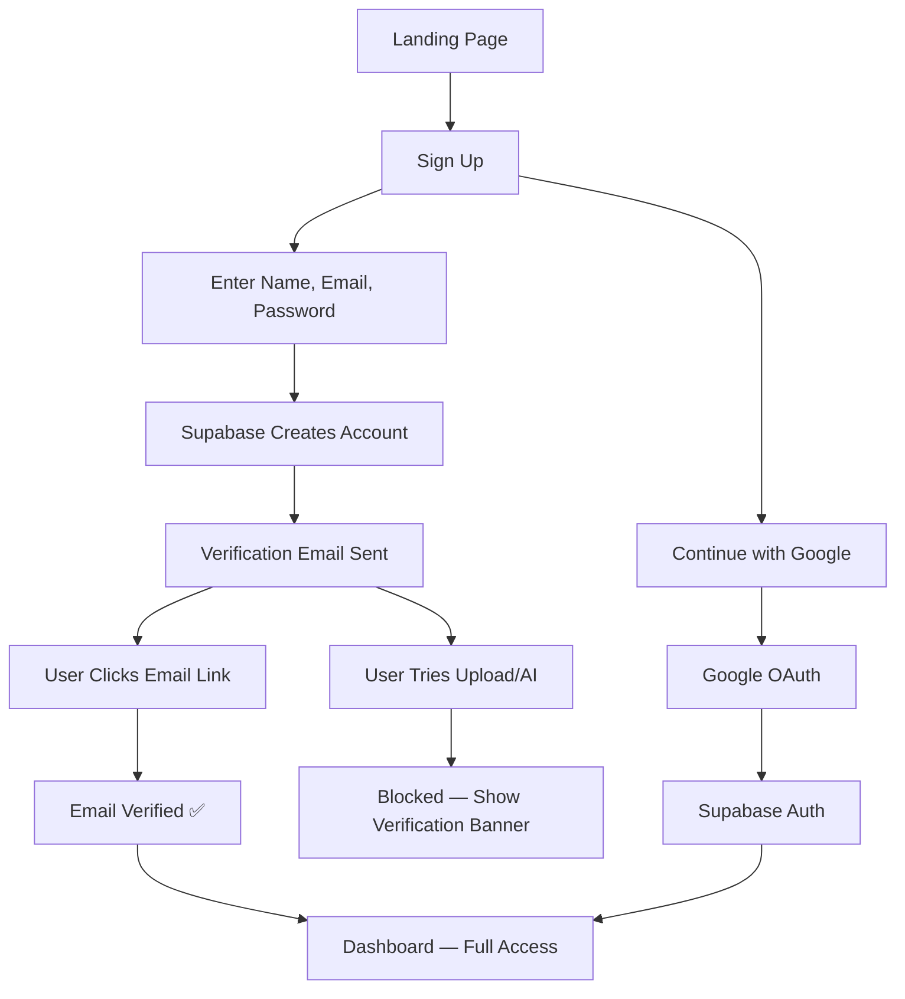
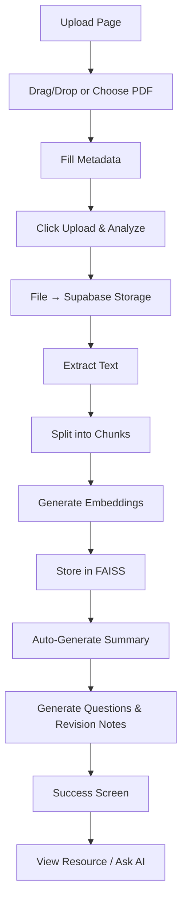
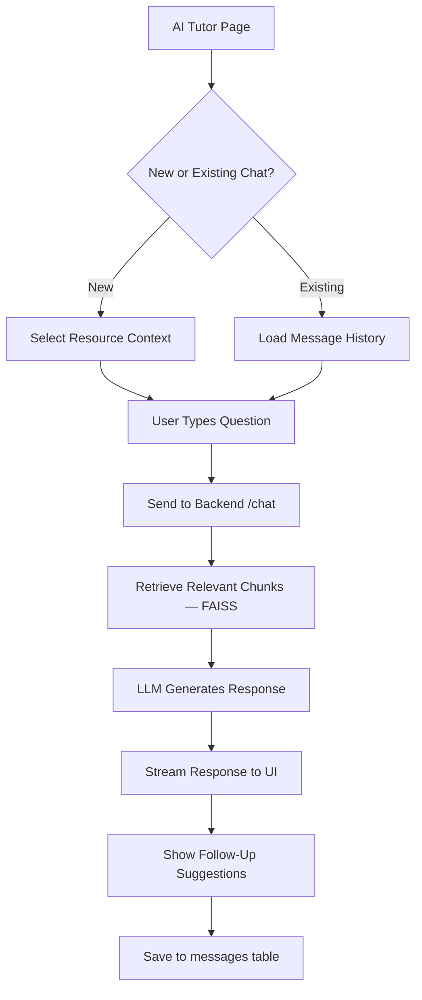
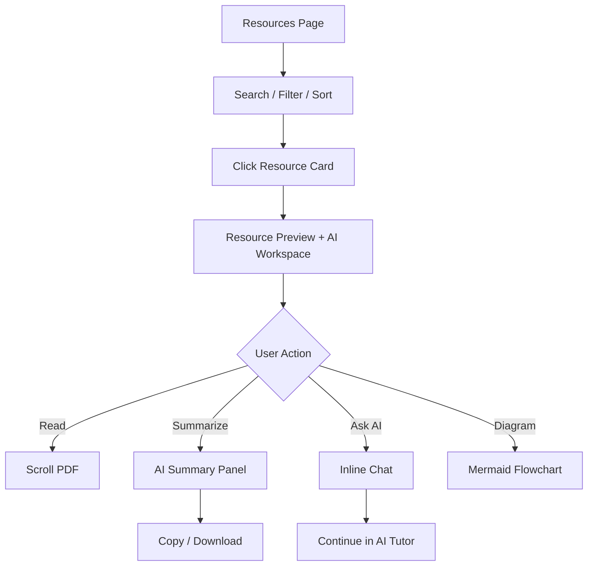

# LearnHub AI – Design Document

> **Version:** 1.0  
> **Source:** [PRD](./prd)  
> **Purpose:** Complete visual, interaction, and implementation design specification for LearnHub AI — a collaborative educational resource sharing platform with a RAG-powered learning assistant.

---

## Table of Contents

1. [Design Philosophy](#1-design-philosophy)
2. [Design System](#2-design-system)
3. [Layout & Navigation](#3-layout--navigation)
4. [Page Specifications](#4-page-specifications)
5. [Component Library](#5-component-library)
6. [Interaction & Motion Design](#6-interaction--motion-design)
7. [Responsive Design](#7-responsive-design)
8. [User Flows](#8-user-flows)
9. [System Architecture (Design View)](#9-system-architecture-design-view)
10. [Data Model Reference](#10-data-model-reference)
11. [API Contract Reference](#11-api-contract-reference)
12. [Environment & Deployment](#12-environment--deployment)
13. [Accessibility & UX Quality](#13-accessibility--ux-quality)
14. [Implementation Priority](#14-implementation-priority)
15. [File & Folder Structure (Frontend)](#15-file--folder-structure-frontend)

---

## 1. Design Philosophy

### 1.1 Vision

LearnHub AI should feel like a **premium AI-first learning workspace** — not a static file repository. Every screen should communicate intelligence, clarity, and momentum. The interface draws inspiration from **ChatGPT** (conversational AI), **Notion** (clean content hierarchy), **Linear** (polished SaaS polish), and modern ed-tech platforms.

### 1.2 Core Design Principles

| Principle | Description |
|-----------|-------------|
| **AI-first** | The AI Tutor is never more than one click away. AI actions are visually distinct (purple/cyan accents). |
| **Minimal & focused** | Reduce visual noise. One primary action per screen region. |
| **Seamless context switching** | Users move fluidly between Resources ↔ AI Tutor ↔ PDF Preview without losing state. |
| **Delight through motion** | Subtle animations reinforce feedback — never decorative-only. |
| **Trust & clarity** | Verified badges, upload progress, streaming AI responses build confidence. |
| **Responsive by default** | Desktop workspace, tablet split-view, mobile bottom-nav experience. |

### 1.3 Target Users (Design Implications)

| User | Primary Needs | UI Emphasis |
|------|---------------|-------------|
| **Students** | Upload, browse, ask doubts, revise | Quick actions, chat history, revision tools |
| **Educators** | Share content, track engagement | Upload flow, resource analytics (views/likes) |
| **Administrators** | Moderate, manage indexing | Admin panel (future), delete/moderate controls |

---

## 2. Design System

### 2.1 Color Palette

#### Brand Colors

| Token | Hex | Usage |
|-------|-----|-------|
| `--color-primary` | `#2563EB` | Primary buttons, links, active nav, focus rings |
| `--color-ai-purple` | `#7C3AED` | AI Tutor branding, AI action buttons, chat bubbles (assistant) |
| `--color-accent-cyan` | `#06B6D4` | Highlights, badges, gradient accents, hover glows |
| `--color-bg-dark` | `#0B1020` | Hero backgrounds, dark mode base, footer |
| `--color-sidebar` | `#111827` | Sidebar background (dark theme) |
| `--color-surface` | `#F8FAFC` | Cards, panels, input backgrounds (light theme) |
| `--color-border` | `#E5E7EB` | Dividers, card borders, input borders |
| `--color-text-primary` | `#0F172A` | Headings, primary body text |
| `--color-text-secondary` | `#475569` | Descriptions, metadata, placeholders |

#### Semantic Colors

| Token | Hex | Usage |
|-------|-----|-------|
| `--color-success` | `#10B981` | Upload success, verified email |
| `--color-warning` | `#F59E0B` | Pending verification, processing |
| `--color-error` | `#EF4444` | Form errors, failed uploads |
| `--color-info` | `#3B82F6` | Informational toasts |

#### Gradient Definitions

```css
/* Hero gradient — animated background */
--gradient-hero: linear-gradient(135deg, #0B1020 0%, #1E1B4B 40%, #2563EB 100%);

/* AI accent gradient — buttons, badges, chat header */
--gradient-ai: linear-gradient(135deg, #7C3AED 0%, #06B6D4 100%);

/* Card hover glow */
--gradient-glow: radial-gradient(circle at 50% 0%, rgba(124, 58, 237, 0.15), transparent 70%);

/* Subtle surface gradient for cards */
--gradient-surface: linear-gradient(180deg, #FFFFFF 0%, #F8FAFC 100%);
```

### 2.2 Typography

| Element | Font | Weight | Size (Desktop) | Size (Mobile) | Line Height |
|---------|------|--------|----------------|---------------|-------------|
| H1 (Hero) | Poppins | 700 | 48px / 3rem | 32px / 2rem | 1.2 |
| H2 (Section) | Poppins | 600 | 32px / 2rem | 24px / 1.5rem | 1.3 |
| H3 (Card title) | Poppins | 600 | 20px / 1.25rem | 18px / 1.125rem | 1.4 |
| Body | Inter | 400 | 16px / 1rem | 15px / 0.9375rem | 1.6 |
| Body Small | Inter | 400 | 14px / 0.875rem | 13px / 0.8125rem | 1.5 |
| Label / Caption | Inter | 500 | 12px / 0.75rem | 12px / 0.75rem | 1.4 |
| Code / Diagrams | JetBrains Mono | 400 | 14px / 0.875rem | 13px / 0.8125rem | 1.6 |

**Font loading:** Google Fonts — `Poppins`, `Inter`, `JetBrains Mono`.

### 2.3 Spacing & Layout Tokens

| Token | Value | Usage |
|-------|-------|-------|
| `--page-padding` | 24px | Page horizontal/vertical padding |
| `--section-gap` | 48px | Gap between major sections |
| `--card-padding` | 20px | Internal card padding |
| `--card-radius` | 16px | Cards, modals, panels |
| `--button-radius` | 12px | Buttons, inputs, badges |
| `--sidebar-width` | 260px | Desktop sidebar |
| `--topnav-height` | 64px | Sticky top navigation |
| `--chat-input-height` | 56px | Sticky chat input bar |
| `--bottom-nav-height` | 64px | Mobile bottom navigation |

### 2.4 Shadows & Elevation

```css
--shadow-sm: 0 1px 2px rgba(15, 23, 42, 0.05);
--shadow-md: 0 4px 12px rgba(15, 23, 42, 0.08);
--shadow-lg: 0 8px 24px rgba(15, 23, 42, 0.12);
--shadow-xl: 0 16px 48px rgba(15, 23, 42, 0.16);
--shadow-glow-ai: 0 0 24px rgba(124, 58, 237, 0.25);
--shadow-glow-primary: 0 0 20px rgba(37, 99, 235, 0.2);
```

### 2.5 Border & Glass Effects

For overlays, modals, and hero elements:

```css
--glass-bg: rgba(255, 255, 255, 0.08);
--glass-border: rgba(255, 255, 255, 0.12);
--glass-blur: blur(12px);
```

Use glassmorphism sparingly on: hero stat cards, floating AI prompt chips, mobile drawer overlays.

### 2.6 Iconography

- **Library:** Lucide React
- **Size:** 16px (inline), 20px (buttons), 24px (nav), 32px (empty states)
- **Stroke:** 1.5px default, 2px for active states

| Context | Icon |
|---------|------|
| Home | `Home` |
| Resources | `BookOpen` |
| Upload | `Upload` |
| AI Tutor | `Bot` or `Sparkles` |
| My Chats | `MessageSquare` |
| Profile | `User` |
| Like | `Heart` |
| Views | `Eye` |
| AI Questions | `MessageCircle` |
| Summary | `FileText` |
| Questions | `HelpCircle` |
| Revision | `Zap` |
| Diagram | `GitBranch` |

---

## 3. Layout & Navigation

### 3.1 Application Shell (Authenticated)

```
┌──────────────────────────────────────────────────────────────────┐
│  TOP NAV (64px, sticky)                                          │
│  Logo | Search | Notifications | Avatar                          │
├──────────────┬───────────────────────────────────────────────────┤
│              │                                                   │
│  SIDEBAR     │              MAIN WORKSPACE                       │
│  (260px)     │              (scrollable)                         │
│              │                                                   │
│  🏠 Home     │                                                   │
│  📚 Resources│                                                   │
│  ⬆️ Upload   │                                                   │
│  🤖 AI Tutor │                                                   │
│  🕘 My Chats │                                                   │
│  👤 Profile  │                                                   │
│              │                                                   │
└──────────────┴───────────────────────────────────────────────────┘
```

#### Top Navigation

| Element | Behavior |
|---------|----------|
| **Logo** | Click → Home/Dashboard. Includes sparkle icon + "LearnHub AI" wordmark. |
| **Global Search** | Expandable search bar. Searches resources + chat history. Keyboard shortcut: `Ctrl/Cmd + K`. |
| **Notifications** | Bell icon with badge. Shows upload complete, email verified, AI ready. |
| **Avatar dropdown** | Profile, Settings, Logout. Shows verification status badge if unverified. |

#### Sidebar

- Fixed width: **260px**
- Background: `#111827` (dark) with light text OR light theme variant with `#F8FAFC` bg
- Active item: left border accent (`4px solid #2563EB`) + subtle background highlight
- Collapsible on tablet (< 1024px) → hamburger toggle
- Hover: background `#1F2937`, icon color shift to cyan

### 3.2 Route Map

| Route | Page | Auth Required | Email Verified |
|-------|------|---------------|----------------|
| `/` | Landing / Home | No | — |
| `/login` | Sign In | No | — |
| `/signup` | Sign Up | No | — |
| `/auth/callback` | OAuth Callback | — | — |
| `/verify-email` | Email Verification Prompt | Yes | No |
| `/forgot-password` | Forgot Password | No | — |
| `/reset-password` | Reset Password | No | — |
| `/dashboard` | Dashboard Home | Yes | Yes |
| `/resources` | Resource Library | Yes | Yes |
| `/resources/:id` | Resource Preview + AI | Yes | Yes |
| `/upload` | Upload Material | Yes | Yes |
| `/ai-tutor` | AI Tutor Chat | Yes | Yes |
| `/ai-tutor/:conversationId` | Continue Chat | Yes | Yes |
| `/my-chats` | Chat History | Yes | Yes |
| `/profile` | User Profile | Yes | Partial |

### 3.3 Unverified User Experience

When logged in but email **not verified**:

- Show persistent amber banner: *"Verify your email to upload resources and use AI features."*
- Disable: Upload, AI Tutor, My Chats, Ask AI buttons
- Allow: Browse resources (read-only), view profile, resend verification email
- Overlay lock icon on disabled nav items with tooltip

---

## 4. Page Specifications

### 4.1 Landing Page (Home — Public)

#### Hero Section

```
┌─────────────────────────────────────────────────────────────────┐
│                                                                 │
│     ✨ LearnHub AI                                              │
│                                                                 │
│     Your collaborative AI-powered learning workspace            │
│                                                                 │
│     Upload study materials • Learn with AI • Revise smarter     │
│                                                                 │
│     [ 📚 Explore Resources ]    [ 🤖 Open AI Tutor ]            │
│                                                                 │
│     ── animated gradient mesh background ──                     │
│     ── floating particle/orb effects (subtle) ──                │
└─────────────────────────────────────────────────────────────────┘
```

**Interactive elements:**
- Animated gradient mesh background (CSS `@keyframes` slow shift, 20s loop)
- Floating orbs with parallax on mouse move (desktop only)
- CTA buttons with hover lift (`translateY(-2px)`) + glow shadow
- Typing effect on tagline (optional, subtle)

#### Popular Resources Carousel

- Horizontal scroll with snap points
- Card hover: scale `1.02`, shadow elevation increase
- Auto-scroll pause on hover
- "View All" link → `/resources`

#### Continue Learning Section (Authenticated)

- Shows last 3 viewed resources + last AI conversation
- Cards with progress ring (optional future) and "Continue" CTA

#### AI Study Tools Section

Four feature cards in a grid:

| Tool | Icon | Description |
|------|------|-------------|
| Summarize | `FileText` | Auto 5-line summary after upload |
| Important Questions | `HelpCircle` | Exam/interview question extraction |
| Revision Notes | `Zap` | Concise bullet-point sheets |
| Diagrams | `GitBranch` | Educational flowcharts |

Each card: icon with gradient background, title, 1-line description, hover border glow.

#### Platform Statistics

Animated count-up on scroll into view:

- Total Resources
- Active Learners
- AI Questions Answered
- Subjects Covered

Glass-style stat cards on dark gradient strip.

#### Footer

- Quick links: About, Resources, AI Tutor, Privacy, Terms
- Social icons
- "Built with RAG + LLM" badge

---

### 4.2 Authentication Pages

#### Sign Up

```
┌─────────────────────────────────────┐
│         LearnHub AI                 │
│                                     │
│  Name      [________________]       │
│  Email     [________________]       │
│  Password  [________________] 👁     │
│                                     │
│  [ Create Account ]                 │
│                                     │
│  ─────── or continue with ───────   │
│                                     │
│  [ G  Continue with Google ]        │
│                                     │
│  Already have an account? Sign In   │
└─────────────────────────────────────┘
```

**Design details:**
- Split layout on desktop: left = brand illustration/gradient panel, right = form
- Real-time password strength indicator (weak/fair/strong)
- Inline validation with shake animation on error
- Google button: white bg, Google logo, subtle border
- Success state → redirect to `/verify-email` with instructions

#### Sign In

- Same split layout
- "Remember me" checkbox
- "Forgot password?" link
- Google OAuth button

#### Email Verification (`/verify-email`)

- Illustration: envelope with sparkle
- Message: "Check your inbox for a verification link"
- Resend button with 60s cooldown timer
- Auto-redirect to dashboard on verification (poll or webhook)

#### Forgot / Reset Password

- Minimal single-column form
- Success toast with email sent confirmation

---

### 4.3 Dashboard

The dashboard is the authenticated home — a personalized command center.

```
┌─────────────────────────────────────────────────────────────────┐
│  Good morning, Harsha 👋                                        │
│  Ready to learn something new today?                              │
├─────────────────────────────────────────────────────────────────┤
│                                                                 │
│  ┌─────────────┐  ┌─────────────┐  ┌─────────────┐             │
│  │ 📚 Browse   │  │ ⬆️ Upload   │  │ 🤖 Ask AI   │             │
│  │ Resources   │  │ Material    │  │ Tutor       │             │
│  └─────────────┘  └─────────────┘  └─────────────┘             │
│                                                                 │
│  Recent Resources                          [ View All → ]       │
│  ┌──────┐ ┌──────┐ ┌──────┐ ┌──────┐                           │
│  │ Card │ │ Card │ │ Card │ │ Card │  ← horizontal scroll    │
│  └──────┘ └──────┘ └──────┘ └──────┘                           │
│                                                                 │
│  Continue Learning                                              │
│  ┌──────────────────────────┐  ┌──────────────────────────┐    │
│  │ Last PDF viewed          │  │ Last AI conversation     │    │
│  │ Python Basics            │  │ "Explain normalization"  │    │
│  │ [ Continue Reading ]     │  │ [ Continue Chat ]        │    │
│  └──────────────────────────┘  └──────────────────────────┘    │
│                                                                 │
│  AI Quick Actions                                               │
│  [ Summarize ] [ Questions ] [ Revision ] [ Diagram ]           │
└─────────────────────────────────────────────────────────────────┘
```

**Interactive elements:**
- Greeting changes by time of day
- Quick action cards with icon bounce on hover
- Recent resources: drag-scroll on mobile

---

### 4.4 Resources Page

#### Header Bar

```
┌─────────────────────────────────────────────────────────────────┐
│  📚 Resource Library                                            │
│                                                                 │
│  🔍 [ Search by keyword...                    ] [ Filters ▼ ]  │
│                                                                 │
│  Subject: [All] [Programming] [DBMS] [AI] [Web Dev] ... → scroll│
│  Sort: [ Popularity ▼ ]                                         │
└─────────────────────────────────────────────────────────────────┘
```

#### Resource Grid

- Desktop: 3-column grid
- Tablet: 2-column
- Mobile: 1-column full-width cards
- Staggered fade-in animation on load

#### Resource Card (Detailed Spec)

```
┌──────────────────────────────────────┐
│  ┌──────┐                            │
│  │ PDF  │  [ Programming ]  ← badge  │
│  │ icon │                            │
│  └──────┘                            │
│                                      │
│  Python Basics                       │
│  by Harsha • 2 days ago              │
│                                      │
│  Beginner-friendly notes covering    │
│  variables, loops, and functions.    │
│                                      │
│  👁 120   ❤ 24   💬 18              │
│                                      │
│  [ Read ]          [ Ask AI ✨ ]     │
└──────────────────────────────────────┘
```

| Element | Spec |
|---------|------|
| **Subject badge** | Pill shape, category color-coded (see §4.4.1) |
| **PDF thumbnail** | Generated first-page preview OR gradient placeholder with doc icon |
| **Title** | Poppins 600, truncate at 2 lines |
| **Contributor** | Avatar initial + name, linked to profile |
| **Stats row** | Icons + counts, animated increment on hover |
| **Read button** | Outline primary |
| **Ask AI button** | Gradient AI button (`--gradient-ai`), sparkle icon |

**Card interactions:**
- Hover: `translateY(-4px)`, shadow-lg, subtle gradient glow at top
- Like: heart fill animation (scale pop + color red)
- Click card body → resource detail page

#### 4.4.1 Subject Badge Colors

| Subject | Background | Text |
|---------|------------|------|
| Programming | `#DBEAFE` | `#1D4ED8` |
| DBMS | `#EDE9FE` | `#6D28D9` |
| AI | `#FCE7F3` | `#BE185D` |
| Web Development | `#D1FAE5` | `#047857` |
| Data Structures | `#FEF3C7` | `#B45309` |
| Mathematics | `#E0E7FF` | `#4338CA` |
| Science | `#CCFBF1` | `#0F766E` |
| Interview Prep | `#FEE2E2` | `#B91C1C` |
| Exam Notes | `#F3E8FF` | `#7E22CE` |

#### Empty State

- Illustration: empty bookshelf
- "No resources found. Be the first to upload!"
- CTA: Upload Material

#### Loading State

- Skeleton cards with shimmer animation (3–6 placeholders)

---

### 4.5 Upload Page

```
┌─────────────────────────────────────────────────────────────────┐
│  ⬆️ Upload Study Material                                       │
│                                                                 │
│  ┌ ─ ─ ─ ─ ─ ─ ─ ─ ─ ─ ─ ─ ─ ─ ─ ─ ─ ─ ─ ─ ─ ─ ─ ─ ─ ┐     │
│  │                                                     │     │
│  │         📄  Drag & Drop PDF Here                    │     │
│  │                                                     │     │
│  │              [ Choose File ]                        │     │
│  │                                                     │     │
│  │         Supports: PDF, DOCX, TXT (max 20MB)         │     │
│  └ ─ ─ ─ ─ ─ ─ ─ ─ ─ ─ ─ ─ ─ ─ ─ ─ ─ ─ ─ ─ ─ ─ ─ ─ ─ ┘     │
│                                                                 │
│  Title         [____________________________________]           │
│  Subject       [ Programming                          ▼ ]       │
│  Description   [____________________________________]           │
│                [____________________________________]           │
│                                                                 │
│                [ Upload & Analyze ✨ ]                            │
└─────────────────────────────────────────────────────────────────┘
```

#### Drag & Drop Zone

| State | Visual |
|-------|--------|
| **Default** | Dashed border `#E5E7EB`, subtle bg `#F8FAFC` |
| **Drag over** | Border `#2563EB`, bg `#EFF6FF`, scale `1.01`, glow |
| **File selected** | Solid border, file name + size + remove (×) button |
| **Uploading** | Progress bar with percentage, pulsing AI icon |
| **Error** | Red border, error message below |

#### Post-Upload Success Panel

Animated checklist with staggered reveal:

```
✅ Document uploaded successfully
📑 Summary generated
📌 Important questions created
⚡ Revision notes ready
🧭 Learning diagrams available

[ View Resource ]    [ Ask AI About This ]
```

Each item slides in with checkmark draw animation (200ms stagger).

#### Processing State

While RAG pipeline runs (extract → chunk → embed → FAISS):

- Multi-step progress indicator:
  1. Uploading file
  2. Extracting text
  3. Creating embeddings
  4. Indexing for AI search
- Each step: icon + label + spinner/check

---

### 4.6 AI Tutor Page

The flagship interactive experience — a full chat workspace.

```
┌──────────────────────────────────────────────────────────────────┐
│  Previous Chats          │  LearnHub AI Tutor ✨                │
│  (240px sidebar)         │                                      │
├──────────────────────────┼──────────────────────────────────────┤
│  🔍 Search chats...      │                                      │
│                          │  ┌────────────────────────────────┐  │
│  📘 Python Lists         │  │ User: Explain Python lists     │  │
│  📗 DBMS Normalization   │  └────────────────────────────────┘  │
│  📕 AI Revision Notes    │                                      │
│                          │  ┌────────────────────────────────┐  │
│  ─────────────────       │  │ 🤖 AI: A list is an ordered,   │  │
│  ➕ New Chat             │  │ mutable collection used to     │  │
│                          │  │ store multiple values...       │  │
│                          │  │                                │  │
│                          │  │ ```python                      │  │
│                          │  │ my_list = [1, 2, 3]            │  │
│                          │  │ ```                            │  │
│                          │  └────────────────────────────────┘  │
│                          │                                      │
│                          │  💡 Related Questions                │
│                          │  • Difference between list & tuple   │
│                          │  • List comprehensions               │
│                          │  • Nested lists                      │
│                          │                                      │
│                          │  ┌──────────────────────────────┐ ➤ │
│                          │  │ Type your question...        │   │
│                          │  └──────────────────────────────┘   │
└──────────────────────────┴──────────────────────────────────────┘
```

#### Chat Header

- AI avatar: gradient circle with bot/sparkle icon
- Title: "LearnHub AI Tutor"
- Subtitle: linked resource name (if chat is resource-scoped)
- Actions: New Chat, Download Conversation, Settings

#### Message Bubbles

| Sender | Style |
|--------|-------|
| **User** | Right-aligned, `#2563EB` bg, white text, rounded-2xl (bottom-right sharp) |
| **Assistant** | Left-aligned, `#F8FAFC` bg, dark text, left border accent `#7C3AED`, AI avatar |

#### Message Features

| Feature | Implementation |
|---------|----------------|
| **Markdown rendering** | Headers, lists, bold, italic, blockquotes |
| **Code syntax highlighting** | Prism or Shiki — Python, JS, SQL, etc. |
| **Educational diagrams** | Mermaid.js rendered flowcharts/trees |
| **Copy button** | Appears on hover, top-right of assistant bubble |
| **Streaming effect** | Token-by-token reveal with blinking cursor |
| **Typing indicator** | Three animated dots while AI generates |

#### Suggested Follow-Up Questions

- Appear below last AI response
- Pill-shaped clickable chips
- Hover: bg shift to `--color-ai-purple` at 10% opacity
- Click: auto-fill and send

#### Chat Input Bar (Sticky)

```
┌──────────────────────────────────────────────────────────────┐
│  📎  │  Type your question...                          │  ➤  │
└──────────────────────────────────────────────────────────────┘
```

- Sticky to bottom of chat panel
- Auto-resize textarea (max 4 lines)
- Send on Enter, Shift+Enter for newline
- Attach resource context button (📎) — link chat to a PDF
- Send button: gradient when input has content, disabled state when empty
- Character count (optional, for long inputs)

#### Previous Chats Sidebar

- Search conversations by title/content
- Each item: resource icon + auto-generated title + timestamp
- Active chat: highlighted with left accent bar
- Hover: reveal delete/rename actions
- "New Chat" button at bottom with `+` icon

#### Empty Chat State

- Centered AI avatar with pulse animation
- "Ask me anything about your study materials"
- Starter prompt chips:
  - "Explain this concept simply"
  - "Give me real-world examples"
  - "Create a revision summary"
  - "Generate a flowchart"

---

### 4.7 Resource Preview + AI Workspace

Split-panel learning workspace — the most powerful screen.

```
┌───────────────────────────────┬──────────────────────────────────┐
│                               │  AI Study Tools                  │
│                               │                                  │
│         PDF VIEWER            │  ┌────────────────────────────┐  │
│         (60% width)           │  │ 📑 Summarize               │  │
│                               │  │ 📌 Important Questions      │  │
│   ┌─────────────────────┐     │  │ ⚡ Revision Notes           │  │
│   │                     │     │  │ 🧭 Explain with Diagram     │  │
│   │   Page 1 of 24      │     │  │ 🤖 Ask Doubts               │  │
│   │                     │     │  └────────────────────────────┘  │
│   └─────────────────────┘     │                                  │
│                               │  ┌────────────────────────────┐  │
│   [ ◀ ]  Page 1/24  [ ▶ ]    │  │  AI Output Panel             │  │
│   [ − ]  100%  [ + ]         │  │  (results appear here)       │  │
│                               │  └────────────────────────────┘  │
└───────────────────────────────┴──────────────────────────────────┘
```

#### PDF Viewer Panel (Left — 60%)

| Control | Behavior |
|---------|----------|
| Page navigation | Prev/Next buttons + page input |
| Zoom | 50% – 200%, pinch on mobile |
| Download | Download original PDF |
| Fullscreen | Toggle fullscreen mode |

#### AI Study Tools Panel (Right — 40%)

Tool buttons styled as interactive cards:

| Tool | Action | Output |
|------|--------|--------|
| **Summarize** | Generates 5-line summary, key topics, difficulty, reading time | Structured card |
| **Important Questions** | Lists exam/interview questions | Numbered list, copy all |
| **Revision Notes** | Definitions, formulas, bullet points | Formatted markdown |
| **Explain with Diagram** | Mermaid flowchart | Rendered diagram + explanation |
| **Ask Doubts** | Opens inline mini-chat scoped to this PDF | Chat interface |

**Tool card interaction:**
- Click → loading skeleton in output panel
- Result slides in from bottom
- "Copy" and "Download as .md" actions on output

#### Resizable Split

- Desktop: draggable divider between panels (min 40% / max 70%)
- Tablet: tab switch between "PDF" and "AI Tools"
- Mobile: stacked — PDF top, tools bottom, FAB for Ask AI

---

### 4.8 My Chats Page

Dedicated chat history management.

- Full-width conversation list with search
- Sort by: Recent, Oldest, Most messages
- Each row: title, resource tag, date, message preview, message count
- Bulk actions: delete selected
- Empty state: "Start a conversation with AI Tutor"

---

### 4.9 Profile Page

```
┌─────────────────────────────────────────────────────────────────┐
│  ┌──────┐                                                       │
│  │Avatar│  Harsha Kumar                                         │
│  └──────┘  harsha@email.com  ✅ Verified                        │
│                                                                 │
│  ── Stats ──                                                    │
│  📤 12 Uploads  |  ❤ 48 Likes Received  |  💬 156 AI Chats     │
│                                                                 │
│  ── My Uploads ──                                               │
│  [ Resource cards grid — user's uploads only ]                  │
│                                                                 │
│  ── Settings ──                                                 │
│  [ Edit Profile ]  [ Change Password ]  [ Logout ]              │
└─────────────────────────────────────────────────────────────────┘
```

---

## 5. Component Library

### 5.1 Core Components

| Component | Props / Variants | Notes |
|-----------|------------------|-------|
| `Sidebar` | `collapsed`, `activeRoute` | 260px, nav items with icons |
| `TopNav` | `user`, `onSearch` | Sticky, search, avatar |
| `ResourceCard` | `resource`, `onLike`, `onRead`, `onAskAI` | Hover animations |
| `ChatMessage` | `message`, `sender`, `isStreaming` | Markdown + code + mermaid |
| `ChatInput` | `onSend`, `disabled`, `placeholder` | Sticky, auto-resize |
| `UploadZone` | `onUpload`, `accept`, `maxSize` | Drag & drop |
| `PDFViewer` | `url`, `page`, `onPageChange` | Page nav + zoom |
| `Button` | `variant`: primary, secondary, ai, ghost, danger | 12px radius |
| `Badge` | `subject`, `status` | Category colors |
| `SearchBar` | `onSearch`, `placeholder` | With filter dropdown |
| `Modal` | `open`, `onClose`, `title` | Glass overlay |
| `Toast` | `type`, `message` | Success/error/info |
| `Skeleton` | `variant`: card, text, avatar | Shimmer loading |
| `EmptyState` | `icon`, `title`, `action` | Illustration + CTA |
| `ProgressSteps` | `steps`, `currentStep` | Upload pipeline |
| `ConversationListItem` | `conversation`, `active` | Chat sidebar item |
| `SubjectFilter` | `subjects`, `selected`, `onChange` | Horizontal scroll pills |
| `StatCard` | `label`, `value`, `icon` | Animated count-up |
| `AIToolCard` | `tool`, `onClick`, `loading` | Study tool buttons |
| `MermaidDiagram` | `chart` | Rendered flowchart |
| `EmailVerificationBanner` | `onResend` | Amber persistent banner |

### 5.2 Button Variants

```css
/* Primary */
background: #2563EB; color: white;
hover: #1D4ED8, shadow-glow-primary, translateY(-1px);

/* AI / Gradient */
background: linear-gradient(135deg, #7C3AED, #06B6D4); color: white;
hover: shadow-glow-ai, translateY(-2px);

/* Secondary / Outline */
background: transparent; border: 1px solid #E5E7EB;
hover: bg #F8FAFC;

/* Ghost */
background: transparent; color: #475569;
hover: bg rgba(0,0,0,0.05);
```

---

## 6. Interaction & Motion Design

### 6.1 Animation Principles

- **Duration:** 150ms (micro), 250ms (standard), 400ms (emphasis)
- **Easing:** `cubic-bezier(0.4, 0, 0.2, 1)` for most transitions
- **Reduce motion:** Respect `prefers-reduced-motion` — disable parallax, particles, count-up

### 6.2 Key Animations

| Interaction | Animation |
|-------------|-----------|
| Page transition | Fade + slide up (250ms) |
| Card hover | translateY(-4px) + shadow increase |
| Button hover | translateY(-1px) + glow |
| Like button | Heart scale 1 → 1.3 → 1 + fill red |
| Toast enter | Slide in from top-right |
| Modal open | Backdrop fade + content scale 0.95 → 1 |
| Chat message appear | Fade in + slide up 8px |
| AI streaming | Blinking cursor + token reveal |
| Upload drop zone | Border pulse on drag-over |
| Skeleton loading | Shimmer gradient sweep |
| Checkmark (upload success) | SVG stroke draw animation |
| Sidebar collapse | Width transition 260px → 72px (icons only) |
| Search expand | Width 240px → 400px on focus |
| Stat count-up | Number increment over 1.5s on scroll |

### 6.3 Micro-interactions

- **Copy button:** Icon changes to checkmark for 2s after copy
- **Send button:** Subtle pulse when input receives text
- **Nav item:** Icon rotates slightly on hover (Upload icon)
- **Filter pill:** Background fill transition on select/deselect
- **File remove (×):** Scale down + fade out on click

---

## 7. Responsive Design

### 7.1 Breakpoints

| Name | Width | Layout |
|------|-------|--------|
| `mobile` | < 640px | Single column, bottom nav |
| `tablet` | 640px – 1023px | 2-col grid, collapsible sidebar |
| `desktop` | ≥ 1024px | Full sidebar + multi-column |
| `wide` | ≥ 1280px | Max content width 1280px, centered |

### 7.2 Mobile Layout

```
┌─────────────────────────┐
│  Top Nav (compact)      │
├─────────────────────────┤
│                         │
│     Main Content        │
│     (full width)        │
│                         │
│                    [🤖] │  ← FAB: Ask AI
├─────────────────────────┤
│ 🏠  📚  ➕  🤖  👤     │  ← Bottom Nav (64px)
└─────────────────────────┘
```

#### Mobile-Specific Features

| Feature | Behavior |
|---------|----------|
| **Bottom navigation** | 5 icons: Home, Resources, Upload, AI Tutor, Profile |
| **FAB (Ask AI)** | Floating button, bottom-right above nav, pulse glow |
| **Chat history** | Slide-in drawer from left |
| **Resource cards** | Full-width, stacked vertically |
| **PDF + AI workspace** | Tabbed: "Document" / "AI Tools" |
| **Swipe gestures** | Swipe right → back; swipe left on chat → delete |

### 7.3 Tablet Adaptations

- Sidebar collapses to icon-only (72px) or hamburger drawer
- Resource grid: 2 columns
- AI Tutor: chat history as overlay drawer
- Split PDF workspace: 50/50 or tabbed

---

## 8. User Flows

### 8.1 Registration & Verification



### 8.2 Upload & AI Indexing



### 8.3 AI Chat Flow



### 8.4 Resource Browse → Learn



---

## 9. System Architecture (Design View)

```text
┌─────────────────────────────────────────────────────────────────┐
│                     React Frontend (Vite)                       │
│  ┌──────────┐ ┌──────────┐ ┌──────────┐ ┌──────────────────┐   │
│  │  Pages   │ │Components│ │  Router  │ │  Axios API Layer │   │
│  └──────────┘ └──────────┘ └──────────┘ └──────────────────┘   │
└────────────────────────────┬────────────────────────────────────┘
                             │ HTTPS
                             ▼
┌─────────────────────────────────────────────────────────────────┐
│                     FastAPI Backend (Render)                    │
│  ┌──────┐ ┌───────────┐ ┌──────┐ ┌───────────┐ ┌───────────┐  │
│  │ auth │ │ resources │ │ chat │ │ summaries │ │ diagrams  │  │
│  └──────┘ └───────────┘ └──────┘ └───────────┘ └───────────┘  │
│                             │                                   │
│  ┌──────────────────────────────────────────────────────────┐   │
│  │              RAG Pipeline                                 │   │
│  │  Document Parser → Chunker → Embeddings → FAISS → LLM   │   │
│  └──────────────────────────────────────────────────────────┘   │
└──────┬──────────────┬──────────────────┬───────────────────────┘
       │              │                  │
       ▼              ▼                  ▼
┌─────────────┐ ┌─────────────┐ ┌─────────────────────┐
│  Supabase   │ │  Supabase   │ │  Hugging Face       │
│  Auth       │ │  PostgreSQL │ │  Inference API      │
│             │ │  + Storage  │ │  (LLM)              │
└─────────────┘ └─────────────┘ └─────────────────────┘
```

### 9.1 RAG Pipeline (Visual — for Diagram Tool)

```text
Upload PDF
     ↓
Extract Text
     ↓
Split into Chunks
     ↓
Create Embeddings (all-MiniLM-L6-v2)
     ↓
Store in FAISS
     ↓
User Question
     ↓
Retrieve Relevant Chunks
     ↓
Generate AI Answer (Hugging Face LLM)
```

---

## 10. Data Model Reference

### 10.1 `users`

| Column | Type | Notes |
|--------|------|-------|
| `id` | UUID | Primary key, matches Supabase Auth UID |
| `name` | TEXT | Display name |
| `email` | TEXT | Unique |
| `role` | TEXT | `student`, `educator`, `admin` |
| `email_verified` | BOOLEAN | Gates upload & AI features |
| `created_at` | TIMESTAMP | Auto-set |

### 10.2 `resources`

| Column | Type | Notes |
|--------|------|-------|
| `id` | UUID | Primary key |
| `title` | TEXT | Required |
| `subject` | TEXT | One of 9 categories |
| `description` | TEXT | Optional |
| `file_url` | TEXT | Supabase Storage URL |
| `uploaded_by` | UUID | FK → users.id |
| `views` | INTEGER | Default 0 |
| `likes` | INTEGER | Default 0 |
| `created_at` | TIMESTAMP | Auto-set |

### 10.3 `conversations`

| Column | Type | Notes |
|--------|------|-------|
| `id` | UUID | Primary key |
| `user_id` | UUID | FK → users.id |
| `title` | TEXT | Auto-generated from first message |
| `created_at` | TIMESTAMP | Auto-set |

### 10.4 `messages`

| Column | Type | Notes |
|--------|------|-------|
| `id` | UUID | Primary key |
| `conversation_id` | UUID | FK → conversations.id |
| `sender` | TEXT | `user` or `assistant` |
| `message` | TEXT | Markdown content |
| `created_at` | TIMESTAMP | Auto-set |

### 10.5 Resource Categories (Enum)

1. Programming
2. Database Management Systems
3. Artificial Intelligence
4. Web Development
5. Data Structures
6. Mathematics
7. Science
8. Interview Preparation
9. Exam Notes

---

## 11. API Contract Reference

### 11.1 Authentication

| Method | Endpoint | Description |
|--------|----------|-------------|
| POST | `/auth/signup` | Register with email/password |
| POST | `/auth/login` | Sign in |
| POST | `/auth/logout` | End session |
| POST | `/auth/google` | Google OAuth |
| POST | `/auth/forgot-password` | Send reset email |

### 11.2 Resources

| Method | Endpoint | Description |
|--------|----------|-------------|
| GET | `/resources` | List all (supports search, filter, sort) |
| POST | `/resources` | Upload new resource |
| GET | `/resources/{id}` | Get single resource |
| DELETE | `/resources/{id}` | Delete resource (admin/owner) |

### 11.3 AI Chat

| Method | Endpoint | Description |
|--------|----------|-------------|
| POST | `/chat` | Send message, receive AI response |
| GET | `/conversations/{user_id}` | List user conversations |
| GET | `/messages/{conversation_id}` | Get conversation messages |
| POST | `/conversations` | Create new conversation |

### 11.4 AI Tools

| Method | Endpoint | Description |
|--------|----------|-------------|
| POST | `/summarize` | Generate document summary |
| POST | `/generate-questions` | Extract important questions |
| POST | `/generate-revision-notes` | Create revision sheet |
| POST | `/generate-diagram` | Generate Mermaid diagram |

---

## 12. Environment & Deployment

### 12.1 Environment Variables

**Backend (`.env`):**

```env
HF_TOKEN=your_huggingface_token
SUPABASE_URL=your_supabase_url
SUPABASE_KEY=your_supabase_anon_key
```

**Frontend (`.env`):**

```env
VITE_API_URL=https://your-backend.onrender.com
```

### 12.2 Supabase Auth Settings

| Setting | Value |
|---------|-------|
| Email Confirmation | ON |
| Password Recovery | ON |
| Google OAuth | ON |

**Google OAuth Redirect URLs:**

```text
http://localhost:5173/auth/callback
https://your-app.vercel.app/auth/callback
```

### 12.3 Deployment

| Component | Platform |
|-----------|----------|
| Frontend | Vercel |
| Backend | Render |
| Database | Supabase |

---

## 13. Accessibility & UX Quality

### 13.1 Accessibility (WCAG 2.1 AA Target)

| Requirement | Implementation |
|-------------|----------------|
| Color contrast | Minimum 4.5:1 for text, 3:1 for large text |
| Keyboard navigation | All interactive elements focusable, visible focus ring |
| Screen readers | ARIA labels on icons, live regions for chat streaming |
| Focus management | Trap focus in modals, return focus on close |
| Alt text | All meaningful images and icons described |
| Reduced motion | `prefers-reduced-motion` disables animations |

### 13.2 UX Quality Checklist

- [ ] Loading skeletons on every async data fetch
- [ ] Error boundaries with friendly fallback UI
- [ ] Toast notifications for success/error actions
- [ ] Optimistic UI for likes (revert on failure)
- [ ] Debounced search (300ms)
- [ ] Infinite scroll or pagination on resources (50 per page)
- [ ] Offline indicator if API unreachable
- [ ] Form validation before submit with inline errors
- [ ] Confirmation dialog before delete actions

---

## 14. Implementation Priority

Build in this order (matches PRD §16):

| Phase | Pages / Features | Design Focus |
|-------|------------------|--------------|
| **1** | Auth (Login, Signup, Email Verification, Google OAuth) | Split layout, validation, verification banner |
| **2** | Dashboard + App Shell (Sidebar, TopNav, routing) | Navigation, responsive shell |
| **3** | Resources Page (grid, search, filter, sort, cards) | Card animations, skeleton loading |
| **4** | Upload Page (drag-drop, metadata, progress) | Drop zone states, success checklist |
| **5** | AI Tutor (chat, history, streaming, suggestions) | Chat bubbles, streaming, sidebar |
| **6** | Resource Preview + AI Workspace (split PDF + tools) | Resizable panels, tool cards |
| **7** | Profile, My Chats, Admin moderation | Stats, chat management |
| **8** | Polish (animations, mobile bottom nav, FAB, a11y) | Motion, responsive, accessibility |

---

## 15. File & Folder Structure (Frontend)

```
src/
├── assets/              # Images, illustrations, logos
├── components/
│   ├── layout/
│   │   ├── Sidebar.jsx
│   │   ├── TopNav.jsx
│   │   ├── BottomNav.jsx
│   │   └── DashboardLayout.jsx
│   ├── auth/
│   │   ├── LoginForm.jsx
│   │   ├── SignupForm.jsx
│   │   └── GoogleAuthButton.jsx
│   ├── resources/
│   │   ├── ResourceCard.jsx
│   │   ├── ResourceGrid.jsx
│   │   ├── SubjectFilter.jsx
│   │   └── SearchBar.jsx
│   ├── upload/
│   │   ├── UploadZone.jsx
│   │   └── UploadProgress.jsx
│   ├── chat/
│   │   ├── ChatMessage.jsx
│   │   ├── ChatInput.jsx
│   │   ├── ConversationList.jsx
│   │   ├── SuggestedQuestions.jsx
│   │   └── TypingIndicator.jsx
│   ├── ai-tools/
│   │   ├── AIToolCard.jsx
│   │   ├── SummaryPanel.jsx
│   │   ├── QuestionsPanel.jsx
│   │   ├── RevisionPanel.jsx
│   │   └── MermaidDiagram.jsx
│   ├── pdf/
│   │   └── PDFViewer.jsx
│   └── ui/
│       ├── Button.jsx
│       ├── Badge.jsx
│       ├── Modal.jsx
│       ├── Toast.jsx
│       ├── Skeleton.jsx
│       └── EmptyState.jsx
├── pages/
│   ├── Home.jsx
│   ├── Login.jsx
│   ├── Signup.jsx
│   ├── VerifyEmail.jsx
│   ├── Dashboard.jsx
│   ├── Resources.jsx
│   ├── ResourceDetail.jsx
│   ├── Upload.jsx
│   ├── AITutor.jsx
│   ├── MyChats.jsx
│   └── Profile.jsx
├── hooks/
│   ├── useAuth.js
│   ├── useChat.js
│   └── useResources.js
├── services/
│   ├── api.js
│   ├── auth.js
│   └── supabase.js
├── utils/
│   └── formatters.js
├── App.jsx
├── main.jsx
└── index.css            # Tailwind + CSS custom properties
```

---

## Appendix A: Tailwind CSS Configuration Reference

```javascript
// tailwind.config.js — extend theme
{
  theme: {
    extend: {
      colors: {
        primary: '#2563EB',
        'ai-purple': '#7C3AED',
        'accent-cyan': '#06B6D4',
        'bg-dark': '#0B1020',
        sidebar: '#111827',
        surface: '#F8FAFC',
      },
      fontFamily: {
        heading: ['Poppins', 'sans-serif'],
        body: ['Inter', 'sans-serif'],
        mono: ['JetBrains Mono', 'monospace'],
      },
      borderRadius: {
        card: '16px',
        button: '12px',
      },
      boxShadow: {
        'glow-ai': '0 0 24px rgba(124, 58, 237, 0.25)',
        'glow-primary': '0 0 20px rgba(37, 99, 235, 0.2)',
      },
      animation: {
        'gradient-shift': 'gradientShift 20s ease infinite',
        'float': 'float 6s ease-in-out infinite',
        'shimmer': 'shimmer 2s linear infinite',
        'pulse-glow': 'pulseGlow 2s ease-in-out infinite',
      },
    },
  },
}
```

---

## Appendix B: Capstone Alignment

| Requirement | Design Coverage |
|-------------|-----------------|
| Educational website | Resources page, upload, categories |
| Website-integrated chatbot | AI Tutor page, inline chat in resource view |
| Document ingestion | Upload flow + RAG pipeline visualization |
| Vector-based semantic search | FAISS architecture documented |
| Conversational memory | Chat history, My Chats, persistent messages |
| Context-aware response generation | Resource-scoped chat, RAG retrieval flow |
| Admin/document upload | Upload page, admin delete on resources |
| Full-stack backend integration | API contract, architecture diagram |
| LLM + RAG architecture | RAG pipeline, tech stack |
| Real-world applicability | Complete SaaS-grade UI specification |

---

*This design document is the single source of truth for all visual, interaction, and frontend implementation decisions. All development should reference this document alongside the [PRD](./prd).*
