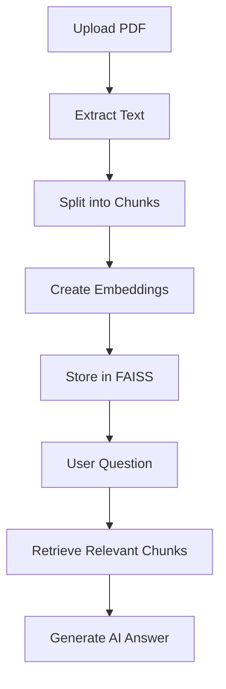

# Module 06: AI Study Tools Module

> **Automatic summaries, question generation, revision notes, diagrams, and knowledge base ingestion**

---

## 1. Module Overview

The AI Study Tools Module provides a suite of **automated learning utilities** that are triggered after document upload or on-demand from the resource detail page. These tools leverage the same RAG pipeline and LLM to help students study more effectively.

### 1.1 Module Goals

- Automatically generate document summaries after upload
- Extract likely exam and interview questions from content
- Create concise revision notes for quick study
- Generate educational flowcharts and structured diagrams
- Ingest FAQ and knowledge base documents for platform-wide AI guidance
- Provide one-click access to all tools from the resource detail page

### 1.2 Tool Summary

| Tool | Trigger | Output |
|------|---------|--------|
| **Auto-Summary** | Automatic on upload | 5-line summary, key topics, difficulty, reading time |
| **Important Questions** | Automatic on upload + on-demand | List of exam/interview questions |
| **Revision Notes** | Automatic on upload + on-demand | Definitions, concepts, formulas, bullet points |
| **Educational Diagrams** | On-demand | Mermaid/text-based flowcharts |
| **FAQ / Knowledge Base** | Admin ingestion | Platform help accessible via RAG |

---

## 2. AI Auto-Summary (Section 6.5)

### 2.1 Overview

After a document is uploaded and indexed, the system **automatically generates a summary** without any user action required. This gives users immediate insight into the document content.

### 2.2 Generated Output

| Field | Description | Example |
|-------|-------------|---------|
| **5-line summary** | Concise overview of the document in exactly 5 sentences | "This document covers the fundamentals of database normalization..." |
| **Key topics covered** | Bulleted list of main topics/sections | "• 1NF and atomic values • 2NF and partial dependencies • 3NF and transitive dependencies" |
| **Difficulty level** | Beginner / Intermediate / Advanced | "Intermediate" |
| **Estimated reading time** | Based on word count (~200 words/min) | "15 minutes" |

### 2.3 Example Output

```text
📑 Summary
━━━━━━━━━━━━━━━━━━━━━━━━━━━━━━━━━━━━━━━

This document provides a comprehensive introduction to Database
Management Systems (DBMS). It covers the evolution from file systems
to modern database systems. Key topics include ER modeling,
normalization (1NF through 3NF), SQL queries, and transaction
management. The material is suitable for undergraduate students
preparing for DBMS examinations.

📌 Key Topics:
• Introduction to DBMS
• Entity-Relationship Modeling
• Normalization (1NF, 2NF, 3NF)
• SQL Queries (SELECT, JOIN, GROUP BY)
• Transaction Management & ACID Properties

📊 Difficulty: Intermediate
⏱ Reading Time: ~18 minutes
```

### 2.4 Processing Flow

```text
Document uploaded and text extracted
        ↓
Full document text sent to LLM with summary prompt
        ↓
LLM generates structured summary
        ↓
Summary stored (cached) for instant display
        ↓
Displayed on resource detail page and upload success screen
```

### 2.5 API Endpoint

```http
POST /summarize
Body: { "resource_id": "uuid" }
Response: { "summary", "key_topics", "difficulty", "reading_time" }
```

---

## 3. Important Question Generator (Section 6.6)

### 3.1 Overview

The AI analyzes uploaded document content and extracts **likely exam or interview questions** that could be asked based on the material. This helps students prepare proactively.

### 3.2 Generated Output

A numbered list of questions ranging from basic definitions to analytical questions:

### 3.3 Example Output

```text
📌 Important Questions
━━━━━━━━━━━━━━━━━━━━━━━━━━━━━━━━━━━━━━━

1. What is normalization?
2. Explain 1NF, 2NF, and 3NF with examples.
3. What are the advantages of DBMS over file systems?
4. Differentiate between DBMS and RDBMS.
5. What is an Entity-Relationship (ER) diagram?
6. Explain the ACID properties of transactions.
7. Write SQL queries for JOIN operations.
8. What is a foreign key and why is it important?
9. Compare clustered and non-clustered indexes.
10. What are the types of database relationships?
```

### 3.4 Question Types Generated

| Type | Description | Example |
|------|-------------|---------|
| **Definition** | "What is X?" | "What is normalization?" |
| **Explanation** | "Explain X with examples" | "Explain 1NF, 2NF, and 3NF." |
| **Comparison** | "Differentiate X and Y" | "Differentiate DBMS and File System." |
| **Advantages/Disadvantages** | "What are the advantages of X?" | "What are the advantages of DBMS?" |
| **Application** | "Write/Design/Implement X" | "Write SQL queries for JOIN operations." |

### 3.5 Processing Flow

```text
Document indexed in FAISS
        ↓
Retrieve all chunks (or top representative chunks)
        ↓
Send to LLM with question extraction prompt
        ↓
LLM generates 8–15 questions
        ↓
Questions stored (cached) for instant display
        ↓
Available on resource detail page AI tools panel
```

### 3.6 API Endpoint

```http
POST /generate-questions
Body: { "resource_id": "uuid" }
Response: { "questions": ["...", "..."] }
```

---

## 4. Quick Revision Notes (Section 6.7)

### 4.1 Overview

Generates **concise revision sheets** from uploaded document content — ideal for last-minute exam preparation. Output is structured for quick scanning.

### 4.2 Generated Content

| Section | Description |
|---------|-------------|
| **Definitions** | Key terms and their concise definitions |
| **Key concepts** | Core ideas explained in 1–2 sentences each |
| **Important formulas** | Mathematical formulas or rules (if applicable) |
| **Short bullet-point notes** | Quick facts, tips, and reminders |

### 4.3 Example Output

```text
⚡ Revision Notes – DBMS Normalization
━━━━━━━━━━━━━━━━━━━━━━━━━━━━━━━━━━━━━━━

📖 Definitions
• Normalization: Process of organizing data to reduce redundancy
• 1NF: Each column contains atomic (indivisible) values
• 2NF: In 1NF + no partial dependencies on composite keys
• 3NF: In 2NF + no transitive dependencies

🔑 Key Concepts
• Redundancy causes update, insert, and delete anomalies
• Decomposition splits tables while preserving data integrity
• Functional dependencies determine normal form compliance
• Denormalization is used for read performance optimization

📐 Important Rules
• 1NF → Atomic values only
• 2NF → Remove partial dependencies
• 3NF → Remove transitive dependencies
• BCNF → Every determinant is a candidate key

📝 Quick Notes
• Always identify candidate keys first
• Draw FD diagrams before decomposing
• Check lossless join after decomposition
• BCNF is stricter than 3NF but not always achievable
```

### 4.4 Processing Flow

```text
Document indexed in FAISS
        ↓
Retrieve representative chunks covering all topics
        ↓
Send to LLM with revision notes prompt
        ↓
LLM generates structured revision sheet
        ↓
Notes stored (cached) for instant display
        ↓
Available on resource detail page + downloadable as .md
```

### 4.5 API Endpoint

```http
POST /generate-revision-notes
Body: { "resource_id": "uuid" }
Response: { "definitions", "concepts", "formulas", "notes" }
```

---

## 5. Educational Diagrams & Flowcharts (Section 6.8)

### 5.1 Overview

Instead of generating AI images, the assistant creates **structured educational diagrams** using text-based formats (primarily Mermaid.js). These are renderable, editable, and lightweight.

### 5.2 Diagram Types

| Type | Use Case | Format |
|------|----------|--------|
| **Flowchart** | Process flows, pipelines, decision trees | Mermaid `graph TD` |
| **Sequence diagram** | Interactions between components | Mermaid `sequenceDiagram` |
| **Concept map** | Relationships between topics | Mermaid `graph LR` |
| **Hierarchy tree** | Taxonomy, classification | Mermaid `graph TD` |

### 5.3 Example: RAG Pipeline Flowchart

```text
Upload PDF
     ↓
Extract Text
     ↓
Split into Chunks
     ↓
Create Embeddings
     ↓
Store in FAISS
     ↓
User Question
     ↓
Retrieve Relevant Chunks
     ↓
Generate AI Answer
```

**Rendered as Mermaid:**



### 5.4 On-Demand Generation

Diagrams are generated **on-demand** when the user clicks "Explain with Diagram" on the resource detail page:

```text
User clicks "Explain with Diagram"
        ↓
User optionally specifies topic (or uses document overview)
        ↓
RAG retrieves relevant chunks
        ↓
LLM generates Mermaid diagram syntax + explanation
        ↓
Frontend renders Mermaid diagram
        ↓
Explanation text displayed below diagram
```

### 5.5 API Endpoint

```http
POST /generate-diagram
Body: { "resource_id": "uuid", "topic": "normalization process" }
Response: { "diagram": "graph TD\n  A[...] --> B[...]", "explanation": "..." }
```

---

## 6. FAQ and Knowledge Base Ingestion (Section 6.9)

### 6.1 Overview

Beyond user-uploaded educational PDFs, the platform supports ingestion of **platform-level documents** that help the AI guide users and answer platform-related questions.

### 6.2 Supported Document Types

| Source | Description | Example Content |
|--------|-------------|-----------------|
| **Uploaded educational PDFs** | User-contributed study materials | DBMS notes, Python tutorials |
| **FAQs** | Frequently asked questions about the platform | "How do I upload a PDF?" |
| **Admin knowledge base** | Admin-provided help documents | Platform usage guide |
| **Course guidelines** | Program-specific instructions | Capstone submission guidelines |

### 6.3 Ingestion Pipeline

All document types use the **same RAG pipeline**:

```text
Document provided (PDF, TXT, or admin-uploaded)
        ↓
Extract Text
        ↓
Split into Chunks
        ↓
Create Embeddings (all-MiniLM-L6-v2)
        ↓
Store in FAISS (tagged by source type)
        ↓
Searchable via vector-based semantic retrieval
```

### 6.4 Retrieval Behavior

| Query Type | Retrieval Scope |
|------------|-----------------|
| **Platform question** | "How do I upload?" → Searches FAQ/KB index |
| **Document question** | "Explain normalization" → Searches resource-specific index |
| **General question** | "What is AI?" → Searches all indexes |

### 6.5 Admin Management

| Action | Who | Description |
|--------|-----|-------------|
| Upload FAQ document | Admin | Add/update FAQ content |
| Upload KB document | Admin | Add platform help documents |
| Re-index document | Admin | Re-process document through pipeline |
| Delete KB entry | Admin | Remove from FAISS index |

---

## 7. Resource Detail AI Tools Panel

All study tools are accessible from the **Resource Preview + AI Workspace** page:

```text
┌──────────────────────────────┐
│  AI Study Tools              │
│                              │
│  📑 Summarize               │
│  📌 Important Questions      │
│  ⚡ Revision Notes           │
│  🧭 Explain with Diagram     │
│  🤖 Ask Doubts               │
│                              │
│  ┌────────────────────────┐  │
│  │  Output Panel          │  │
│  │  (results appear here) │  │
│  └────────────────────────┘  │
└──────────────────────────────┘
```

### 7.1 Tool Interaction Flow

```text
User clicks a tool button (e.g., "Summarize")
        ↓
Button shows loading state (spinner)
        ↓
If cached → Display instantly
If not cached → API call to generate
        ↓
Result slides into output panel
        ↓
Actions available: Copy, Download as .md
```

### 7.2 Caching Strategy

| Tool | Cached After | Cache Location |
|------|-------------|----------------|
| Auto-Summary | First upload processing | Database or file storage |
| Important Questions | First upload processing | Database or file storage |
| Revision Notes | First upload processing | Database or file storage |
| Diagrams | Generated on-demand | Not cached (generated fresh each time) |

---

## 8. Post-Upload Automatic Generation

When a document is uploaded, the following tools run **automatically** in the background:

```text
✅ Document uploaded successfully
📑 Summary generated          ← Auto-Summary
📌 Important questions created ← Question Generator
⚡ Revision notes ready        ← Revision Notes
🧭 Learning diagrams available ← Available on-demand
```

| Step | Tool | Timing |
|------|------|--------|
| 1 | Text extraction + FAISS indexing | During upload |
| 2 | Auto-Summary generation | Immediately after indexing |
| 3 | Important Questions generation | Immediately after indexing |
| 4 | Revision Notes generation | Immediately after indexing |
| 5 | Diagrams | On-demand only (not auto-generated) |

---

## 9. API Endpoints Summary

| Method | Endpoint | Tool |
|--------|----------|------|
| POST | `/summarize` | Auto-Summary |
| POST | `/generate-questions` | Important Questions |
| POST | `/generate-revision-notes` | Revision Notes |
| POST | `/generate-diagram` | Educational Diagrams |

See [Module 11 – API Specification](./11-api-specification.md) for detailed request/response formats.

---

## 10. LLM Prompt Templates

### 10.1 Summary Prompt

```text
Summarize the following educational document. Provide:
1. A 5-sentence summary
2. Key topics covered (as bullet points)
3. Difficulty level (Beginner/Intermediate/Advanced)
4. Estimated reading time

Document content:
{document_text}
```

### 10.2 Questions Prompt

```text
Extract 10 important exam or interview questions from this educational
document. Include a mix of definition, explanation, comparison, and
application questions.

Document content:
{document_text}
```

### 10.3 Revision Notes Prompt

```text
Create concise revision notes from this document. Include:
- Key definitions
- Core concepts (1-2 sentences each)
- Important formulas or rules
- Quick bullet-point notes for exam preparation

Document content:
{document_text}
```

### 10.4 Diagram Prompt

```text
Create a Mermaid flowchart diagram explaining "{topic}" based on the
document content. Also provide a brief explanation of the diagram.

Document content:
{retrieved_chunks}
```

---

*Previous: [05 – Chat History Module](./05-chat-history-module.md) | Next: [07 – Technology Stack](./07-technology-stack.md)*
